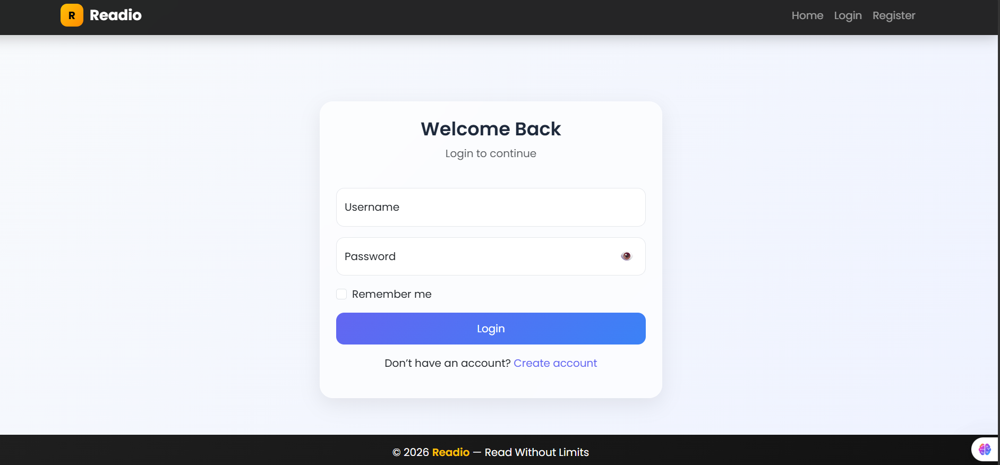
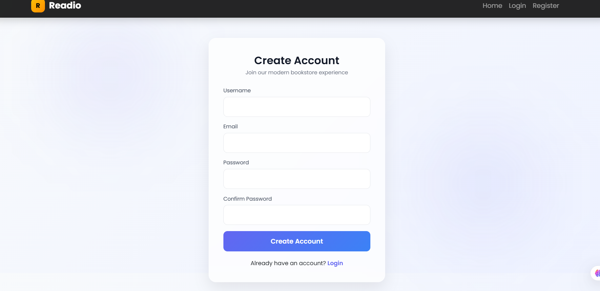
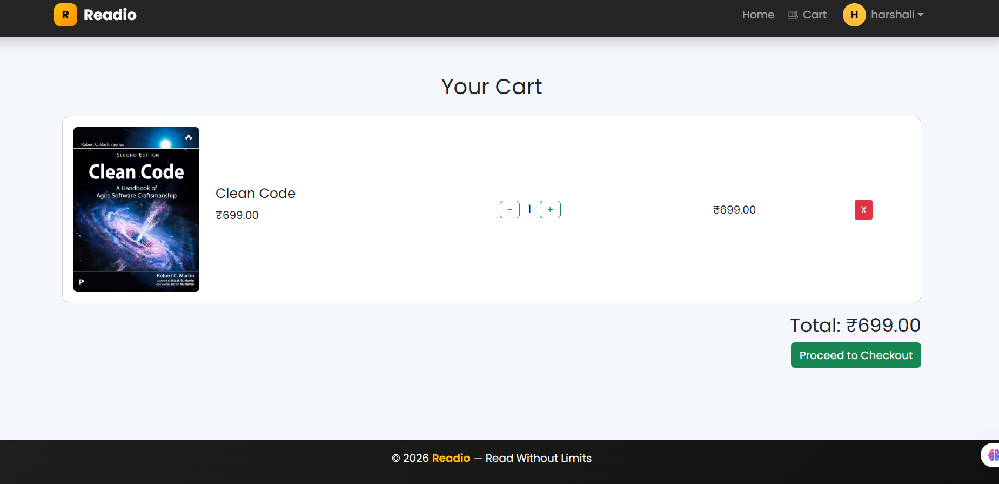
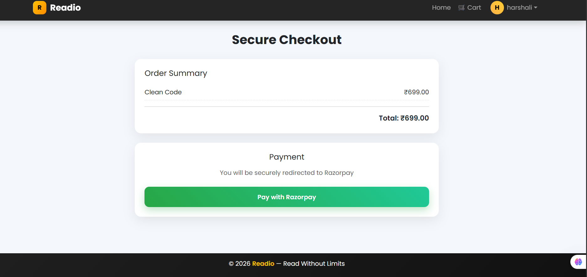
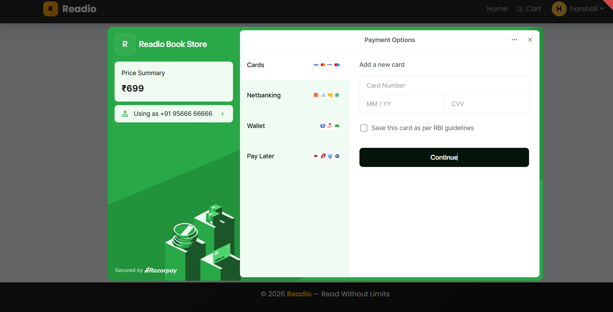
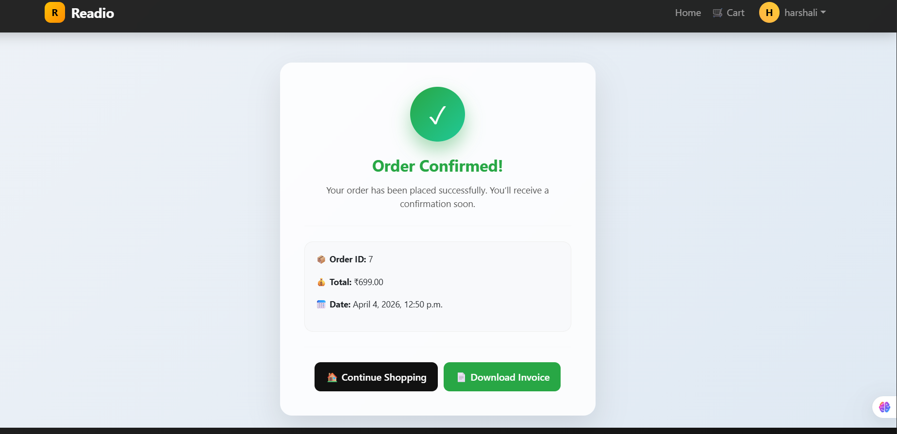
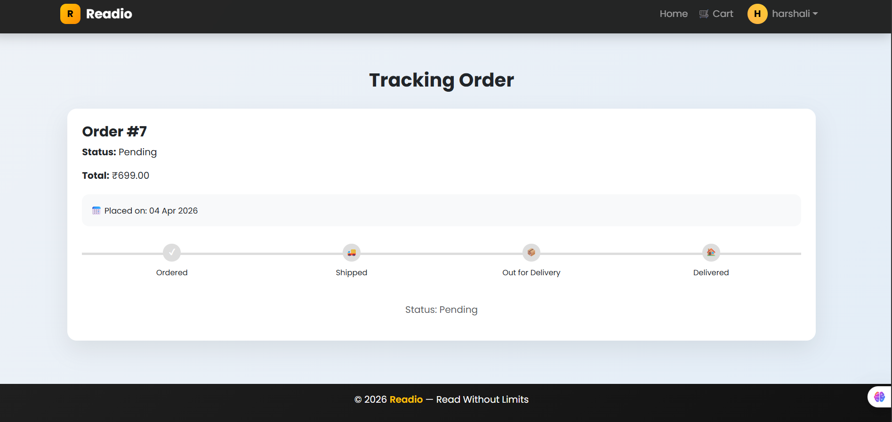
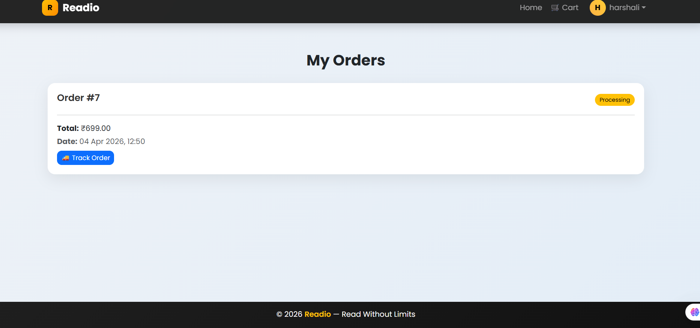
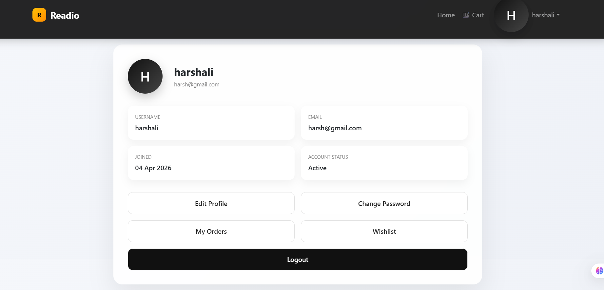
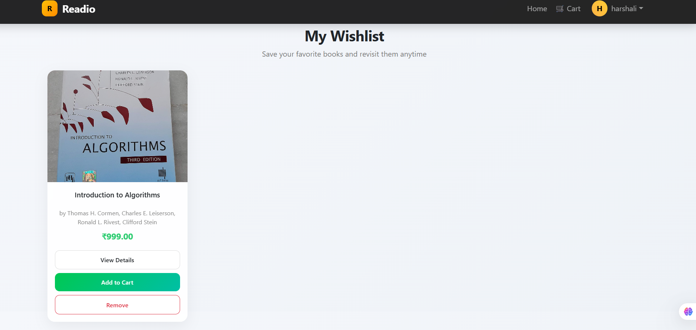

# Readio — Online Bookstore

Readio is a modern web-based online bookstore application developed using Django.

The platform allows users to browse books, manage carts, maintain wishlists, place orders, and make secure online payments using Razorpay.

The project also includes REST API support tested using Thunder Client for backend communication and future mobile/web integration.

---

# Features

## User Authentication

* User Registration
* User Login & Logout
* Secure Authentication System
* User Profile Management

## Book Management

* Browse Available Books
* View Detailed Book Information
* Book Categories & Listings

## Cart & Wishlist

* Add Books to Cart
* Remove Books from Cart
* Wishlist Functionality
* Automatic Cart Total Calculation

## Payment System

* Razorpay Payment Gateway Integration
* Secure Payment Verification
* Checkout System
* Payment Success & Failure Handling

## Order Management

* Place Orders
* Order Tracking
* Order History

## REST API Support

* REST API Integration using Django REST Framework
* JSON-based API Responses
* Backend API Communication
* API Testing using Thunder Client

## User Interface

* Responsive Design
* Modern UI using Bootstrap
* Mobile-Friendly Layout

---

# Technology Stack

| Technology            | Purpose                   |
| --------------------- | ------------------------- |
| Python                | Backend Programming       |
| Django                | Web Framework             |
| Django REST Framework | REST API Development      |
| HTML5                 | Frontend Structure        |
| CSS3                  | Styling                   |
| Bootstrap             | Responsive UI             |
| JavaScript            | Client-side Functionality |
| SQLite                | Database                  |
| Razorpay              | Payment Gateway           |
| Thunder Client        | API Testing               |

---

# Project Structure

```bash
Readio-Book-Store/
│
├── bookstore/
│   ├── settings.py
│   ├── urls.py
│   ├── asgi.py
│   └── wsgi.py
│
├── shop/
│   ├── migrations/
│   ├── templates/
│   ├── static/
│   ├── models.py
│   ├── views.py
│   ├── serializers.py
│   ├── api_views.py
│   ├── urls.py
│   └── admin.py
│
├── templates/
├── static/
├── media/
├── db.sqlite3
├── manage.py
├── requirements.txt
├── .env
├── .gitignore
└── README.md
```

---

# Installation Guide

## 1. Clone Repository

```bash
git clone https://github.com/Harshali-14/Readio-Book-Store.git

cd bookstore
```

---

## 2. Create Virtual Environment

```bash
python -m venv venv
```

### Activate Virtual Environment

**Windows**

```bash
venv\Scripts\activate
```

**Mac/Linux**

```bash
source venv/bin/activate
```

---

## 3. Install Dependencies

```bash
pip install -r requirements.txt
```

---

# Configure Environment Variables

Create a `.env` file in the root directory.

```env
SECRET_KEY=your_secret_key

DEBUG=True

RAZORPAY_KEY_ID=your_razorpay_key_id

RAZORPAY_KEY_SECRET=your_razorpay_secret_key
```

---

# Apply Database Migrations

```bash
python manage.py makemigrations

python manage.py migrate
```

---

# Create Superuser

```bash
python manage.py createsuperuser
```

---

# Run Development Server

```bash
python manage.py runserver
```

Open Browser:

```bash
http://127.0.0.1:8000/
```

---

# REST API Endpoints

## Sample API URLs

```bash
/api/books/
/api/cart/
/api/orders/
/api/payment/
```

## API Features

* JSON Response Handling
* REST Architecture
* Backend Data Communication
* Future Mobile App Support

## API Testing

REST APIs were tested using Thunder Client in Visual Studio Code.

---

# Razorpay Payment Integration

Readio uses Razorpay for secure online payment processing.

## Payment Features

* Secure Checkout
* Payment Verification using Razorpay Signature
* Online Payment Management
* Payment Status Handling

---

# Security Features

* CSRF Protection Enabled
* Secure Authentication System
* Environment Variables for Sensitive Data
* Secure Payment Verification
* Django Built-in Security Features

---

# Screenshots

## Homepage


## Login Page



## Register Page



## Cart Page



## Checkout Page



## Razorpay Integration



## Payment Processing


## Payment Success



## Order Tracking



## Orders Page



## Profile Page



## Wishlist Page



---

# Future Improvements

* Advanced Search & Filtering
* Email Notifications
* Multiple Payment Methods
* Admin Analytics Dashboard
* Mobile Application Support

---

# requirements.txt

Generate automatically using:

```bash
pip freeze > requirements.txt
```

---

# Author

**Harshali Kulkarni**
MCA Student
Python & Django Developer

---

# License

This project is developed for educational and learning purposes.
